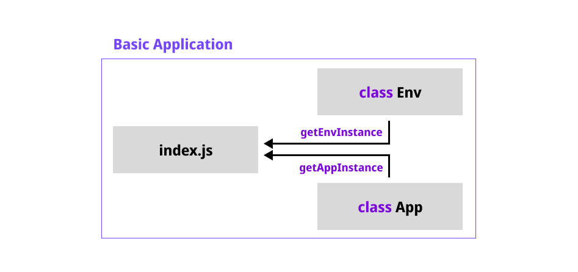

# Architecture

> Architecture is layout of something.  
> `Server Architecture` is layout of Server, for...  
> - good for Maintenance
> - good to develope
>
> References(origin) [> Click](https://www.techopedia.com/definition/30262/server-architecture#:~:text=Server%20architecture%20is%20the%20foundational,the%20services%20that%20it%20provides.)

## Explain folder structure

`Base-Express` is really small Basic Application.

This app contain only 2 folders for...

- `src/` - run server
- `test/` - test server

## Explain src files

- `index.js`
    - Instant Annonymouse Function to hide _Instance and Values_.
    - Seperate responsiblity
        - From `index.js`...
            - Call environment value to `env.js`.
            - Run application  to `server.js`.
- `env.js`
    - Call environment values from `.env` files.
- `server.js`
    - Run application, using environment values.

