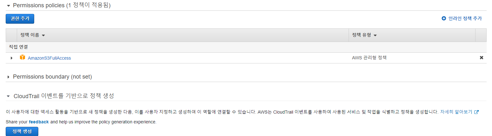
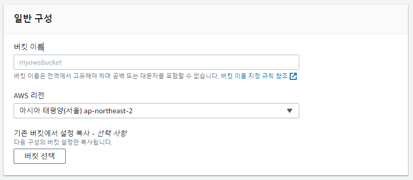
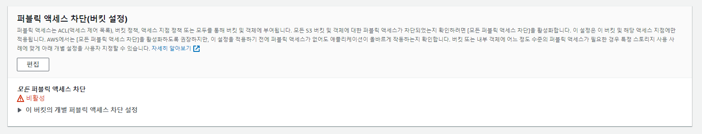
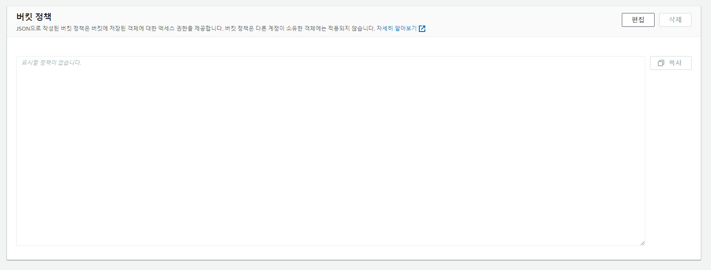
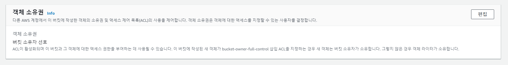

[< 뒤로가기](../README.md)

## IAM + S3 버킷 기본 설정

-   작성자 : @unchaptered
-   작성일자 : `2022-08-18`

### IAM 설정

IAM 설정은 구글링해서 만드는 방식을 보시고 `권한 정책` 고르실 때, `AmazonS3FullAccess` 선택하고 하시면 됩니다.

자세한 내용 보고싶으시면 이름 누르면 직관적으로 알려줍니다

 

### S3 버킷 설정

S3 버킷 만드실 때, 이름은 편하신 걸로 정하시면 됩니다. 근데, 리전은 EC2 인스턴스랑 동일하게 만들어야 접속이 가능합니다.

 

만드실 때, 그냥 기본 설정으로 만드시고 생성 완료되면 거기서 아래 내용들 확인하고 변경하시면 됩니다. 저는 빠르게 기능 구현 하고 싶어서 `Access Denied` 뜰만한 부분은 전부 해제해버렸는데, 좀 위험할 수도 있어서 조금 더 검색해보시면 보안 설정도 보실 수 있을 것 같습니다.

 

 

 

저는 `퍼블릭 엑세스` 항목이 URL 로 접속 할 수 있는가? 라는 내용 같고요.

`ACL` 같은 경우는 저희가 생성한 객체의 소유권을 누구한테 줄 것인가 같아요.

그래서 소유권 설정을 준 사람만 삭제할 수 있습니다.
