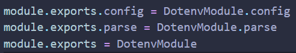
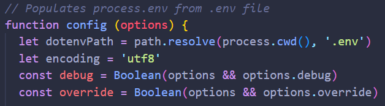
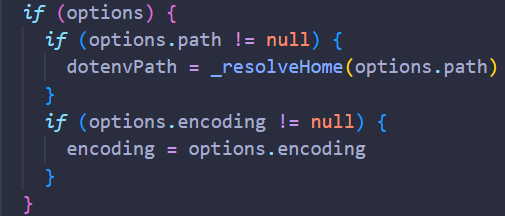
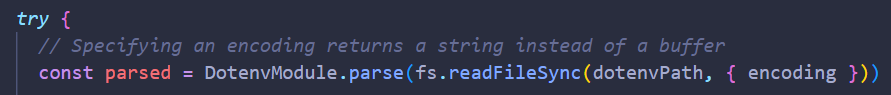

[< 뒤로가기](../README.md)

> 직전에 dotenv.config 사용법을 알려드리게 되는 시간이 있었습니다. 그 때, process 에 대한 질문에 답을 못했었습니다. 그래서 `내가 잘 모르고 있는 것` 을 설명하구나 라는 생각을 하게 되었습니다. 그래서 이번 시간에 dotenv 를 뜯어보고 어떤 친구인지 최대한 알아보았습니다.

## 환경 변수 위치 및 상세 설정

저는 의문이 생기면 모듈 파일을 열어 봅니다.

이번에 `node_modules/dotenv/lib/main.js` 를 열어 보니 총 3 개의 변수/함수 가 내보내지고 있는 것을 확인했습니다.

<p align="center;"></p>

<hr><br>

`dotenv/config` 는 dotenv 파일의 config 함수를 즉시 실행하는 구문으로, 해당 함수를 보면 신기한 것을 알 수 있습니다.

<p align="center;"></p>

config 함수는 `매개변수`로 options 를 받아서 사용할 수 있는 친구였던 것입니다.

그리고, 초기값으로 dotenvPath 와 encoding 이라는 값을 가지고 시작하게 됩니다.

실제로 dotenvPath 에 담기는 코드를 실행시켜 보면, `파일의 현재 경로/.env` 가 출력 되는 것을 확인할 수 있습니다.

```javascript
// test.js
const result = path.resolve(process.cwd(), '.env');
console.log(result);
```

<hr><br>

추가로 아래를 보면, `매개변수`, options 의 유무에 따른 분기 처리가 있습니다.

<p align="center;"></p>

저는 options.encoding 을 따로 사용해보지 않았어서, `options.path` 가 존재할 경우에는 dotenvPath 가 변경되는 부분이 흥미로웠습니다.

<hr><br>

해당 구문에 있는 \_resolveHome() 를 보면...

```javascript
function _resolveHome(envPath) {
    return envPath[0] === '~' ? path.join(os.homedir(), envPath.slice(1)) : envPath;
}
```

즉, 저희가 path 값을 입력하는 것이 실제로 반영되어 다른 파일을 열 수 있다는 것입니다.

> 모듈 파일을 수정해서 실제로 \_resolveHome 이 리턴하는 값을 확인해보면...
>
> -   ~ 로 시작하는 경로를 입력하면 OS 의 기본 경로, _Win 대부분은 `C 드라이브`_, 에서 시작되는 파일을 탐색을 합니다.
> -   그렇지 않은 경우에는 `options.path` 값을 그대로 사용하게 됩니다.

<hr><br>

분기 처리 뒷 부분을 보면, 파일을 읽기 위해서 사용 되는 fs 모듈이 사용되어 있습니다.

<p align="center;"></p>

저희가 `options.path` 를 주면 그 값이 그대로 dotenvPath 에 사용되며, `options.encoding` 을 주지 않으면 'utf8' 에 해당하기 때문에, _.hello_ 와 _test.js_ 파일을 만들고 다음 코드를 실행 시켜 보겠습니다.

```default
// .hello
PORT = 3000;
```

```javascript
const result = fs.readFileSync('.hello', { encoding: 'utf8' });
console.log(result);
```

해당 파일을 실행하면 `PORT = 3000;` 이라는 문자열이 나오게 됩니다.

그 값을 DotenvModule.parse() 라는 메서드가 파싱하여, JS 의 객체 형태로 만드는 것 같습니다. _실제로 라이브러리에 console.log() 를 찍어보면 파싱이 되어 있습니다._

또한 해당 값이 config 함수의 리턴값에 포함되어 있으므로, 우리는 dotenv.config({}) 의 실행 결과로서 파싱이 완료된 객체를 받을 수 있는 것입니다.
