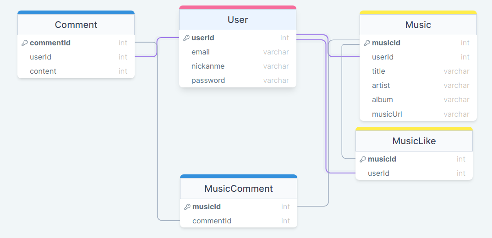

[< 뒤로가기](../README.md)

## 데이터 모델과 Erd

-   작성자 : @unchaptered
-   작성일자 : `2022-08-18`

 

-   User 테이블 [열기](../../../src/sequelize/models/user.js)
-   Music 테이블 [열기](../../../src/sequelize/models/music.js)
-   MusicLike 테이블 [열기](../../../src/sequelize/models/musiclike.js)
-   MusicComment 테이블 [열기](../../../src/sequelize/models/musiccomment.js)
-   Comment 테이블 [열기](../../../src/sequelize/models/comment.js)

 

